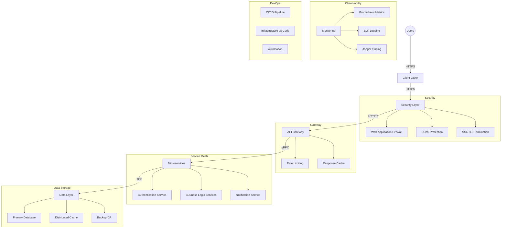

# Cloud Architecture Documentation

## System Architecture Overview

## Component Details

### 1. Client Layer
- Web Applications
- Mobile Applications
- Third-party Integrations

### 2. Security Layer
- Web Application Firewall (WAF)
- DDoS Protection
- SSL/TLS Termination
- Identity and Access Management

### 3. API Gateway
- Request Routing
- Rate Limiting
- Response Caching
- API Documentation
- Load Balancing

### 4. Service Mesh
- Service Discovery
- Circuit Breaking
- Retry Logic
- Traffic Management
- Service-to-Service Authentication

### 5. Microservices
- Authentication Service
- Business Logic Services
- Notification Service
- Event-Driven Architecture
- Domain-Driven Design

### 6. Data Layer
- Primary Database (PostgreSQL)
- Distributed Cache (Redis)
- Backup and Disaster Recovery
- Data Encryption at Rest
- Data Replication

### 7. Observability
- Metrics Collection (Prometheus)
- Logging System (ELK Stack)
- Distributed Tracing (Jaeger)
- Health Monitoring
- Alerting System

### 8. DevOps & CI/CD
- Automated Deployment Pipeline
- Infrastructure as Code
- Automated Testing
- Configuration Management
- Continuous Integration/Deployment

## Key Features

1. **High Availability**
   - Redundant components
   - Auto-scaling
   - Load balancing
   - Failover mechanisms

2. **Security**
   - End-to-end encryption
   - Authentication/Authorization
   - DDoS protection
   - Regular security audits

3. **Scalability**
   - Horizontal scaling
   - Auto-scaling policies
   - Resource optimization
   - Performance monitoring

4. **Maintainability**
   - Modular architecture
   - Clear separation of concerns
   - Comprehensive documentation
   - Version control

5. **Monitoring**
   - Real-time metrics
   - Log aggregation
   - Performance analytics
   - Alert management

## Best Practices

1. **Security**
   - Always encrypt data in transit
   - Implement least privilege access
   - Regular security updates
   - Automated security scanning

2. **Development**
   - Code review process
   - Automated testing
   - Consistent coding standards
   - Documentation requirements

3. **Operations**
   - Automated deployments
   - Infrastructure as code
   - Monitoring and alerting
   - Incident response procedures

4. **Data Management**
   - Regular backups
   - Data retention policies
   - Privacy compliance
   - Data validation